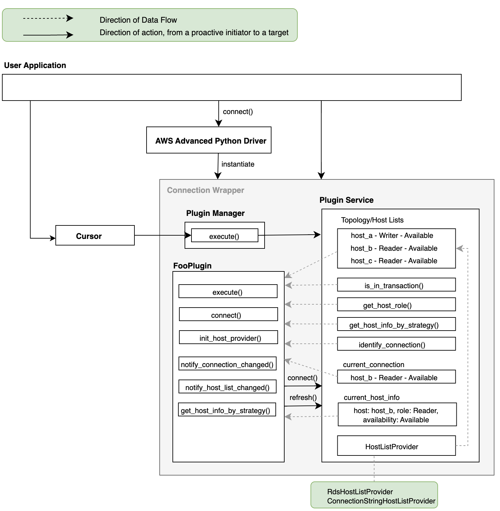

# Architecture

The AWS Advanced Python Driver contains 4 main components:

1. The [connection plugin manager](./PluginManager.md)
2. The [loadable and extensible plugins](./LoadablePlugins.md)
3. The [plugin service](./PluginService.md)
4. The host list providers

The connection plugin manager handles all the loaded or registered plugins and sends the Python method call to be executed by all plugins [**subscribed**](./LoadablePlugins.md#subscribed-methods) to that method.

During execution, plugins may utilize the plugin service to help its execution by retrieving or updating:

- the current connection
- the hosts information or topology of the database

> **NOTES**:
>
> - Each Python Connection object has its own instances of:
>   - plugin manager
>   - plugin service
>   - loaded plugin classes
> - Multiple Python Connection objects opened to the same database server will have separate sets of instances mentioned above.
> - All plugins share the same instance of plugin service and the same instance of host list provider.