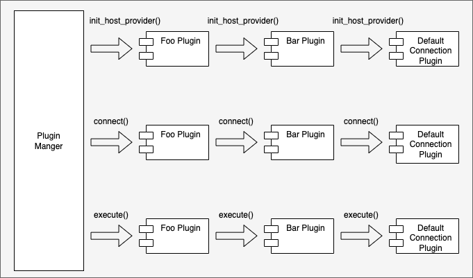

# Pipelines

A plugin pipeline is an execution workflow achieving a specific goal.

The plugin pipelines available in the driver are:
- The connect pipeline
- The force_connect pipeline
- The execute pipeline
- The host list provider pipeline
- The connection changed notification pipeline
- The host list changed notification pipeline
- The accepts strategy pipeline
- The get_host_info_by_strategy pipeline

A plugin does not need to implement all pipelines. A plugin can implement one or more pipelines depending on its functionality.

## Connect Pipeline

The connect pipeline performs any additional setup or post connection steps required to establish a connection. By default, the connect pipeline will establish connections using the `DriverConnectionProvider` class. If you would like to use a non-default `ConnectionProvider` to create connections, you can do so by calling `ConnectionProviderManager.set_connection_provider(connection_provider)`.

The most common usage of the connect pipeline is to fetch extra credentials from external locations.

An example would be the [IAM connection plugin](../using-the-python-driver/using-plugins/UsingTheIamAuthenticationPlugin.md). The IAM connection plugin generates an IAM authentication token to be used when establishing a connection. Since authentication is only required when establishing a connection and not required for any subsequent execution, the IAM authentication plugin only needs to implement the connect pipeline.

## Force Connect Pipeline

The force_connect pipeline is similar to the connect pipeline except that it will use the default `DriverConnectionProvider` class to establish connections regardless of whether a non-default `ConnectionProvider` has been requested via `ConnectionProviderManager.set_connection_provider(connection_provider)`. For most plugins, the connect and force_connect implementation will be equivalent.

## Execute Pipeline

The execute pipeline performs additional work for Python method calls.

Usages for this pipeline include:

- Handling execution exceptions
- Logging and measuring execution information
- Catching execution results
- Updating the host lists before executing the Python method
- Catching network exceptions and performing the failover procedure

## Host List Provider Pipeline

The host list provider pipeline sets up the [Host List Provider](./PluginService.md#host-list-providers) via the plugin service.
This pipeline is executed once during the initialization stage of the connection.

All subscribed plugins are called to set up their respective host list provider.
Since each connection may only have one host list provider,
setting a host list provider in a plugin within the pipeline would override any previously set host list providers.

The host list providers are used to retrieve host information about the database server,
either from the connection string or by querying the database server.
For simple use cases where having up-to-date information on all existing database readers is not necessary,
using a simple host list provider such as the [Connection String Host List Provider](../../aws_advanced_python_wrapper/host_list_provider.py) would be sufficient.
The connection string host list provider parses the host and port information from the connection string during initialization,
it does not perform any additional work.

For cases where keeping updated information on existing and available readers is necessary,
such as during the failover procedure, it is important to have a host list provider that can re-fetch information once in a while,
like the RDS host list provider.
The RDS host list provider should be automatically used by the AWS Advanced Python Driver when the application is connecting to Aurora databases.
However, you can ensure that the provider is used by specifying a topology-aware dialect. For more information, see [Database Dialects](../using-the-python-driver/DatabaseDialects.md).

## Connection Changed Notification Pipeline

Plugins can subscribe to this pipeline to perform special handling when the current connection has changed. Once 
subscribed, plugins should override the `notify_connection_changed` method to implement any desired logic. This method 
will be called whenever the current connection changes. Plugins can also provide suggestions of what to do with the old 
connection by returning a [suggested action](../../aws_advanced_python_wrapper/utils/notifications.py).

## Host List Changed Notification Pipeline

Plugins can subscribe to this pipeline to perform special handling when the current host list of databases has changed. 
Once subscribed, plugins should override the `notify_host_list_changed` method to implement any desired logic. This method
will be called whenever changes in the current host list are detected.

## Accepts Strategy Pipeline

Plugins should subscribe to this pipeline and the `get_host_info_by_strategy` pipeline if they implement a host selection strategy via the `get_host_info_by_strategy` method. In this case, plugins should override the `accepts_strategy` and `get_host_info_by_strategy` methods to implement any desired logic. The `accepts_strategy` method should return `True` for each selection strategy that the plugin supports.

## Get Host Info by Strategy pipeline

Plugins should subscribe to this pipeline and the `accepts_strategy` pipeline if they implement a host selection strategy. In this case, plugins should override both the `accepts_strategy` method and the `get_host_info_by_strategy` method. The `accepts_strategy` method should return `True` for each strategy that can be processed by the plugin in `get_host_info_by_strategy`. The `get_host_info_by_strategy` method should implement the desired logic for selecting a host using any plugin-accepted strategies. Host selection via the "random" strategy is supported by default.
