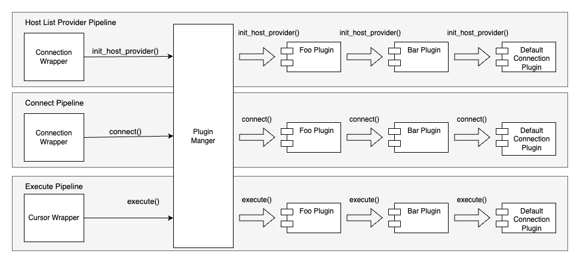

# Connection Plugin Manager

The connection plugin manager has the following main functionalities:

- Load and initialize plugins
- Initiate pipelines

## Load and Initialize Plugins
The connection plugin manager initializes all plugins registered via the [`plugins`](../using-the-python-wrapper/UsingThePythonWrapper.md#connection-plugin-manager-parameters) configuration parameter.

## Initiate Pipelines

During the initial connection phase, where the connection plugin manager gets initialized, it initiates the host list provider and the connect pipeline. These two pipelines will set up a host list provider to be used by all the plugins and the initial connection.

All subsequent database methods calls will trigger the execute pipeline.