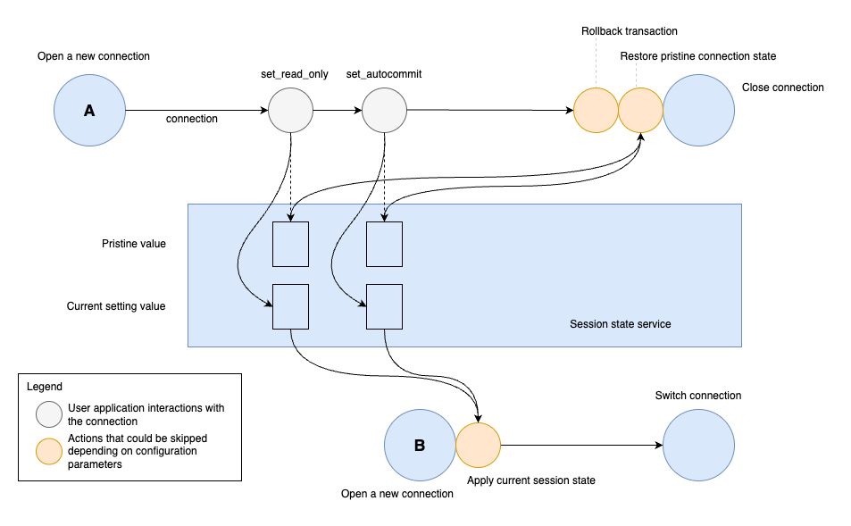

# Session States

## What is a session state?

Every connection is associated with a connection session on the server and a group of related session settings like the autoCommit flag or the readonly flag. The following session settings are tracked by the AWS Advanced Python Driver, and together they form a session state:
- autoCommit (`autocommit`)
- readOnly (`read_only`)

Since the AWS Advanced Python Driver can transparently switch physical connection to a server (for instance, during a cluster failover), it's important to re-apply the current session state to a new connection during such switch.   

## Tracking Session States Changes

The diagram above shows the process of switching one database connection `A` to a new connection `B`. After connection `A` is established, it's returned to the user application, and the user application may use this connection to query data from the database as well as to change some session settings.
For example, if the user application sets the `read_only` value on a connection, the AWS Advanced Python Driver intercepts this operation and stores a new session setting for the `read_only` setting. At the same time, the driver verifies if the original session setting is known or not. If the original setting is not known, the driver will fetch the value of `read_only` and store it as a pristine value in order to save the original session setting. Later, the driver may need the pristine value to restore the connection session state to its original state.   

## Restore to the Original Session State

Before closing an existing connection, the AWS Advanced Python Driver may try to reset all changes to the session state made by the user application. Some application frameworks and connection pools may intercept calls that close connections and may perform additional connection configuration. Since the AWS Advanced Python Driver might change the internal physical connection to a server, a new physical connection's settings may become unexpected to the user application and may cause errors. It is also important to mention that calling `close()` on a connection while using connection pooling doesn't close the connection or stop communicating to a server. Instead, the connection is returned to a pool of available connections. Cleaning up a session state before returning a connection to a pool is necessary to avoid side effects and errors when a connection is retrieved from a pool to be reused.

Before closing a connection, the AWS Advanced Python Driver sets its session state settings with the pristine values that have been previously stored in the driver. If a pristine value isn't available, it means that there have been no changes to that particular setting made by the user application, and that it's safe to assume that this setting is in its original/unchanged state. 

Session state reset can be disabled by using the `reset_session_state_on_close` configuration parameter.

## Transfer Session State to a new Connection

When the driver needs to switch to a new connection, it opens a new connection and transfers a session state to it. All current session state values are applied to the new connection. Pristine values for a new connection are also fetched and stored if needed. When a new connection is configured, it replaces the current internal connection.

Session transfer can be disabled by using the `transfer_session_state_on_switch` configuration parameter.

## Session State Custom handlers

It is possible to extend or replace existing logic of resetting session state and transferring session state with custom handlers. Use the following methods on `aws_advanced_python_wrapper.states.SessionStateTransferHandlers` class to set and reset custom handlers:
- `set_reset_session_state_on_close_func`
- `clear_reset_session_state_on_close_func`
- `set_transfer_session_state_on_switch_func`
- `reset_transfer_session_state_on_switch_func`
