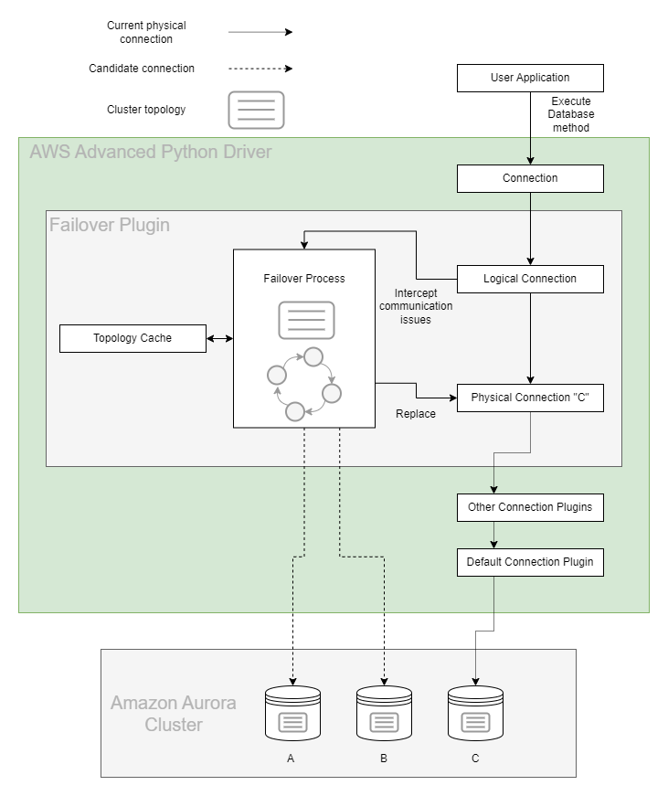

# Failover Plugin

In an Amazon Aurora database (DB) cluster, failover is a mechanism by which Aurora automatically repairs the DB cluster status when a primary DB instance becomes unavailable. It achieves this goal by electing an Aurora Reader to become the new primary DB instance, so that the DB cluster can provide maximum availability to a primary read-write DB instance. The AWS Advanced Python Driver uses the Failover Plugin to coordinate with this behavior in order to provide minimal downtime in the event of a DB instance failure.

## The AWS Advanced Python Driver Failover Process

The figure above provides a simplified overview of how the AWS Advanced Python Driver handles an Aurora failover encounter. Starting at the top of the diagram, an application uses the AWS Advanced Python Driver to get a logical connection to an Aurora database.

In this example, the application requests a connection using the Aurora DB cluster endpoint and is returned with a logical connection that is physically connected to the primary DB instance in the DB cluster, DB instance C. By design, details about which specific DB instance the physical connection is connected to have been abstracted away.

Over the course of the application's lifetime, it executes various statements against the logical connection. If DB instance C is stable and active, these statements succeed and the application continues as normal. If DB instance C experiences a failure, Aurora will initiate failover to promote a new primary DB instance. At the same time, the AWS Advanced Python Driver will intercept the related communication exception and kick off its own internal failover process.

If the primary DB instance has failed, the AWS Advanced Python Driver attempts to use its internal topology cache to temporarily connect to an active Aurora Reader. This Aurora Reader will be periodically queried for the DB cluster topology until the new primary DB instance is identified (DB instance A or B in this case). If the driver is unable to connect to an active Aurora Reader or the cluster is still being reconfigured, the driver will retry the connection until it is successful.

At this point, the Python Driver will connect to the new primary DB instance and return control to the application by raising a FailoverSuccessError so you can reconfigure the session state as needed. Although the DNS endpoint for the DB cluster might not yet resolve to the new primary DB instance, the AWS Advanced Python Driver has already discovered this new DB instance during its failover process, and will be directly connected to it when the application continues executing statements. In this way the AWS Advanced Python Driver provides a faster way to reconnect to a newly promoted DB instance, thus increasing the availability of the DB cluster.

## Using the Failover Plugin

The failover plugin will be loaded by default if the [`plugins`](../UsingThePythonDriver.md#connection-plugin-manager-parameters) parameter is not specified. The failover plugin can also be explicitly loaded by adding the plugin code `failover` to the [`plugins`](../UsingThePythonDriver.md#aws-advanced-python-driver-parameters) parameter. After you load the plugin, the failover feature will be enabled by default and the `enable_failover` parameter will be set to True.     Please refer to the [failover configuration guide](../FailoverConfigurationGuide.md) for tips to keep in mind when using the failover plugin.

### Failover Parameters

In addition to the parameters that you can configure for the underlying driver, you can pass the following connection parameters to the AWS Advanced Python Driver to specify additional failover behavior.

| Parameter                                    |  Value  |                                     Required                                     | Description                                                                                                                                                                                                                                                                                                                                                                                                                                                                                                                                                                                                                                                                                                                                                                                                                                                                                                                                                                                                          | Default Value                                                                                                                                                                                                      |
|----------------------------------------------|:-------:|:--------------------------------------------------------------------------------:|:---------------------------------------------------------------------------------------------------------------------------------------------------------------------------------------------------------------------------------------------------------------------------------------------------------------------------------------------------------------------------------------------------------------------------------------------------------------------------------------------------------------------------------------------------------------------------------------------------------------------------------------------------------------------------------------------------------------------------------------------------------------------------------------------------------------------------------------------------------------------------------------------------------------------------------------------------------------------------------------------------------------------|--------------------------------------------------------------------------------------------------------------------------------------------------------------------------------------------------------------------|
| `failover_mode`                              | String  |                                        No                                        | Defines a mode for failover process. Failover process may prioritize hosts with different roles and connect to them. Possible values:   - `strict_writer` - Failover process follows writer host and connects to a new writer when it changes. - `reader_or_writer` - During failover, the driver tries to connect to any available/accessible reader host. If no reader is available, the driver will connect to a writer host. This logic mimics the logic of the Aurora read-only cluster endpoint. - `strict_reader` - During failover, the driver tries to connect to any available reader host. If no reader is available, the driver raises an error. Reader failover to a writer host will only be allowed for single-host clusters. This logic mimics the logic of the Aurora read-only cluster endpoint.  If this parameter is omitted, default value depends on connection URL. For Aurora read-only cluster endpoint, it's set to `reader_or_writer`. Otherwise, it's `strict_writer`. | Default value depends on connection URL. For Aurora read-only cluster endpoint, it's set to `reader_or_writer`. Otherwise, it's `strict_writer`.                                                                   |
| `cluster_instance_host_pattern`              | String  | If connecting using an IP address or custom domain URL: Yes  Otherwise: No | This parameter is not required unless connecting to an AWS RDS cluster via an IP address or custom domain URL. In those cases, this parameter specifies the cluster instance DNS pattern that will be used to build a complete instance endpoint. A "?" character in this pattern should be used as a placeholder for the DB instance identifiers of the instances in the cluster. See [here](#host-pattern) for more information.   Example: `?.my-domain.com`, `any-subdomain.?.my-domain.com:9999`  Use case Example: If your cluster instance endpoints follow this pattern:`instanceIdentifier1.customHost`, `instanceIdentifier2.customHost`, etc. and you want your initial connection to be to `customHost:1234`, then your connection parameters should look like this: `host=customHost:1234 cluster_instance_host_pattern=?.customHost`                                                                                                                                                   | If the provided connection string is not an IP address or custom domain, the AWS Advanced Python Driver will automatically acquire the cluster instance host pattern from the customer-provided connection string. |
| `enable_failover`                            | Boolean |                                        No                                        | Set to `True` to enable the fast failover behavior offered by the AWS Advanced Python Driver. Set to `False` for simple database connections that do not require fast failover functionality.                                                                                                                                                                                                                                                                                                                                                                                                                                                                                                                                                                                                                                                                                                                                                                                                                        | `True`                                                                                                                                                                                                             |
| `failover_cluster_topology_refresh_rate_sec` | Integer |                                        No                                        | Cluster topology refresh rate in seconds during a writer failover process. During the writer failover process, cluster topology may be refreshed at a faster pace than normal to speed up discovery of the newly promoted writer.                                                                                                                                                                                                                                                                                                                                                                                                                                                                                                                                                                                                                                                                                                                                                                                    | `2`                                                                                                                                                                                                                |
| `failover_reader_connect_timeout_sec`        | Integer |                                        No                                        | Maximum allowed time in seconds to attempt to connect to a reader instance during a reader failover process.                                                                                                                                                                                                                                                                                                                                                                                                                                                                                                                                                                                                                                                                                                                                                                                                                                                                                                         | `30`                                                                                                                                                                                                               |
| `failover_timeout_sec`                       | Integer |                                        No                                        | Maximum allowed time in seconds to attempt reconnecting to a new writer or reader instance after a cluster failover is initiated.                                                                                                                                                                                                                                                                                                                                                                                                                                                                                                                                                                                                                                                                                                                                                                                                                                                                                    | `300`                                                                                                                                                                                                              |
| `failover_writer_reconnect_interval_sec`     | Integer |                                        No                                        | Interval of time in seconds to wait between attempts to reconnect to a failed writer during a writer failover process.                                                                                                                                                                                                                                                                                                                                                                                                                                                                                                                                                                                                                                                                                                                                                                                                                                                                                               | `2`                                                                                                                                                                                                                |
| `keep_session_state_on_failover`             | Boolean |                                        No                                        | This parameter will allow connections to retain the session state after failover. When `keep_session_state_on_failover` is set to False, connections will need to be reconfigured as seen in the example [here](../../examples/PGFailover.py). When this parameter is True, the autocommit and read_only values will be kept. This parameter is only necessary when the session state must be retained and the connection cannot be manually reconfigured by the user.    **Please note:** this parameter will not be able to fully restore the connection session state, as it will only save the autocommit and read_only values.                                                                                                                                                                                                                                                                                                                                                                            | `False`                                                                                                                                                                                                            |

## Host Pattern

When connecting to Aurora clusters, the [`cluster_instance_host_pattern`](#failover-parameters) parameter is required if the connection string does not provide enough information about the database cluster domain name. If the Aurora cluster endpoint is used directly, the AWS Advanced Python Driver will recognize the standard Aurora domain name and can re-build a proper Aurora instance name when needed. In cases where the connection string uses an IP address, a custom domain name, or localhost, the driver won't know how to build a proper domain name for a database instance endpoint. For example, if a custom domain was being used and the cluster instance endpoints followed a pattern of `instanceIdentifier1.customHost`, `instanceIdentifier2.customHost`, etc., the driver would need to know how to construct the instance endpoints using the specified custom domain. Since there isn't enough information from the custom domain alone to create the instance endpoints, you should set the `cluster_instance_host_pattern` to `?.customHost`,  so that the connection parameters include `host=customHost cluster_instance_host_pattern=?.customHost`. Refer to [this diagram](../../images/failover_behavior.png) about AWS Advanced Python Driver behavior during failover for different connection URLs and more details and examples.

## Failover Errors

| Errors                            | Is the connection valid? | Can the connection be reused? | Has the session state changed? | Does the session need to be reconfigured? | Does the last query need to be re-executed? | Does the transaction need to be restarted? |
|-----------------------------------|--------------------------|-------------------------------|--------------------------------|-------------------------------------------|---------------------------------------------|--------------------------------------------|
| FailoverFailedError               | No                       | No                            | N/A                            | N/A                                       | Yes                                         | Yes                                        |
| FailoverSuccessError              | Yes                      | Yes                           | Yes                            | Yes                                       | Yes                                         | N/A                                        |
| TransactionResolutionUnknownError | Yes                      | Yes                           | Yes                            | Yes                                       | Yes                                         | Yes                                        |

### FailoverFailedError

When the AWS Advanced Python Driver throws a `FailoverFailedError`, the original connection has failed, and the AWS Advanced Python Driver tried to failover to a new instance, but was unable to. There are various reasons this may happen: no hosts were available, a network failure occurred, and so on. In this scenario, please wait until the server is up or other problems are solved. (Exception will be thrown.)

### FailoverSuccessError

When the AWS Advanced Python Driver raises a `FailoverSuccessError`, the original connection has failed while outside a transaction, and the AWS Advanced Python Driver successfully failed over to another available instance in the cluster. However, any session state configuration of the initial connection is now lost. In this scenario, you should:

- Reuse and reconfigure the original connection (e.g., reconfigure session state to be the same as the original connection).
- Recreate the `Cursor` object.
- Repeat the query that was executed when the connection failed, and continue work as desired.

### TransactionResolutionUnknownError

When the AWS Advanced Python Driver throws a `TransactionResolutionUnknownError`, the original connection has failed within a transaction. In this scenario, the AWS Advanced Python Driver first attempts to rollback the transaction and then fails over to another available instance in the cluster. Note that the rollback might be unsuccessful as the initial connection may be broken at the time that the AWS Advanced Python Driver recognizes the problem. Note also that any session state configuration of the initial connection is now lost. In this scenario, you should:

- Reuse and reconfigure the original connection (e.g: reconfigure session state to be the same as the original connection).
- Recreate the `Cursor` object.
- Restart the transaction and repeat all queries which were executed during the transaction before the connection failed.
- Repeat the query that was executed when the connection failed and continue work as desired.

#### Sample Code

[PostgreSQL Failover Sample Code](../../examples/PGFailover.py)  
[MySQL Failover Sample Code](../../examples/MySQLFailover.py)

> [!WARNING]\
> **Warnings About Proper Usage of the AWS Advanced Python Driver**
> 1. A common practice when using Python drivers is to wrap invocations against a Connection object in a try-except block, and dispose of the Connection object if an Exception is hit. If this practice is left unaltered, the application will lose the fast-failover functionality offered by the AWS Advanced Python Driver. When failover occurs, the AWS Advanced Python Driver internally establishes a ready-to-use connection inside the original Connection object before throwing an exception to the user. If this Connection object is disposed of, the newly established connection will be thrown away. The correct practice is to check the exception type for failover errors and reuse the Connection object if the error type indicates successful failover. The [PostgreSQL Failover Sample Code](../../examples/PGFailover.py) demonstrates this practice. See the section about [Failover Errors](#failover-errors) for more details.
  
> 2. We highly recommended that you use the cluster and read-only cluster endpoints instead of the direct instance endpoints of your Aurora cluster, unless you are confident in your application's use of instance endpoints. Although the AWS Advanced Python Driver will correctly failover to the new writer instance when using instance endpoints, use of these endpoints is discouraged because individual instances can spontaneously change reader/writer status when failover occurs. the AWS Advanced Python Driver will always connect directly to the instance specified if an instance endpoint is provided, so a write-safe connection cannot be assumed if the application uses instance endpoints.
