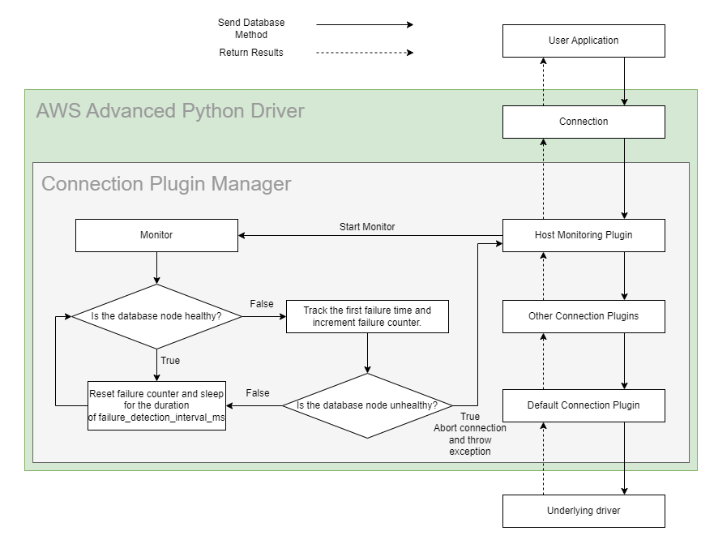
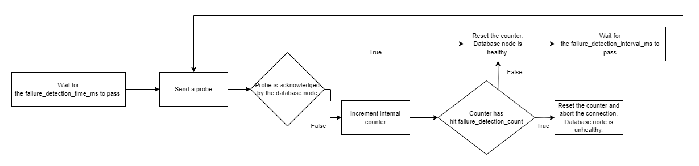

# Host Monitoring Plugin

## Enhanced Failure Monitoring

The figure that follows shows a simplified Enhanced Failure Monitoring (EFM) workflow. Enhanced Failure Monitoring is a feature available from the Host Monitoring Connection Plugin. The Host Monitoring Connection Plugin periodically checks the connected database node's health or availability. If a database node is determined to be unhealthy, the connection will be aborted. The Host Monitoring Connection Plugin uses the [Enhanced Failure Monitoring Parameters](#enhanced-failure-monitoring-parameters) and a database node's responsiveness to determine whether a node is healthy.

<div style="text-align:center"></div>

### The Benefits of Enhanced Failure Monitoring

Enhanced Failure Monitoring helps user applications detect failures earlier. When a user application executes a query, EFM may detect that the connected database node is unavailable. When this happens, the query is cancelled and the connection will be aborted. This allows queries to fail fast instead of waiting indefinitely or failing due to a timeout.

One use case is to pair EFM with the [Failover Connection Plugin](./UsingTheFailoverPlugin.md). When EFM discovers a database node failure, the connection will be aborted. Without the Failover Connection Plugin, the connection would be terminated up to the user application level. With the Failover Connection Plugin, the AWS Advanced Python Driver can attempt to failover to a different, healthy database node where the query can be executed.

### Network Timeouts

Not all community Python drivers support network timeouts. If connectivity to a node is lost, and the underlying driver does not support network timeouts, the driver may wait indefinitely for communication between the driver and the node.

To alleviate this issue, some drivers may support various network timeout settings, such as a socket timeout or TCP keepalive configuration. To configure these settings for the drivers that support it, use the AWS Advanced Python Driver [Network Timeout](../UsingThePythonDriver.md#network-timeouts) settings.

The Host Monitoring plugin uses two different methods to detect network failures depending on the underlying drivers' network timeout configurability:

|   | Target Driver Features    | Network Failure Detection Method           |
|---|---------------------------|--------------------------------------------|
| 1 | Supports socket timeouts  | Pinging the server with a "select 1" query |
| 2 | Supports connect timeouts | Attempt to establish a new connection      |

1) If the underlying driver supports socket timeout configurations, the Host Monitoring Plugin will use socket timeouts to ping the server.
2) On the other hand, in the scenario where the driver does not support socket timeouts and any execute queries may hang indefinitely if the network connectivity is down, the AWS Advanced Python Driver will use connect timeouts and check network availability by establishing new connections.

> :warning: Note: For either detection method the Host Monitoring Plugin requires creating one or more background connections. This also requires the target driver to support aborting connections from a separate thread so that any monitoring resources are properly cleaned up.

### Using the Host Monitoring Connection Plugin

The Host Monitoring Connection Plugin will be loaded by default if the [`plugins`](../UsingThePythonDriver.md#connection-plugin-manager-parameters) parameter is not specified. The Host Monitoring Connection Plugin can also be explicitly loaded by adding the plugin code `host_monitoring` to the [`plugins`](../UsingThePythonDriver.md#aws-advanced-python-driver-parameters) parameter, or by adding it to the current [driver profile](../UsingThePythonDriver.md#aws-advanced-python-driver-parameters). Enhanced Failure Monitoring is enabled by default when the Host Monitoring Connection Plugin is loaded, but it can be disabled by setting the `failure_detection_enabled` parameter to `False`.

> :warning: **Note:** When loading the Host Monitoring Connection Plugin, the order plugins are loaded in matters. We recommend that you load the Host Monitoring Connection Plugin at the end (or as close to the end) of the plugin list as possible. When used in conjunction with the Failover Connection Plugin, the Host Monitoring Connection Plugin must be loaded after the Failover Connection Plugin. For example, when loading plugins with the `plugins` parameter, the parameter value should be set to `failover,...,host_monitoring`.
> 
### Enhanced Failure Monitoring Parameters

<div style="text-align:center"></div>

The parameters `failure_detection_time_ms`, `failure_detection_interval_ms`, and `failure_detection_count` are similar to TCP Keepalive parameters. Each connection has its own set of parameters. `failure_detection_time_ms` controls how long the monitor waits after a SQL query is executed before sending a probe to the database node. `failure_detection_interval_ms` controls how often the monitor sends probes to the database after the initial probe. `failure_detection_count` controls how many times a monitor probe can go unacknowledged before the database node is deemed unhealthy. 

To determine the health of a database node: 
1. The monitor will first wait for a time equivalent to the `failure_detection_time_ms`. 
2. Then, every `failure_detection_interval_ms`, the monitor will send a probe to the database node. 
3. If the probe is not acknowledged by the database node, a counter is incremented. 
4. If the counter reaches the `failure_detection_count`, the database node will be deemed unhealthy and the connection will be aborted.

If a more aggressive approach to failure checking is necessary, all of these parameters can be reduced to reflect that. However, increased failure checking may also lead to an increase in false positives. For example, if the `failure_detection_interval_ms` was shortened, the plugin may complete several connection checks that all fail. The database node would then be considered unhealthy, but it may have been about to recover and the connection checks were completed before that could happen.

| Parameter                       |  Value  | Required | Description                                                                                                  | Default Value |
|---------------------------------|:-------:|:--------:|:-------------------------------------------------------------------------------------------------------------|---------------|
| `failure_detection_count`       | Integer |    No    | Number of failed connection checks before considering database node as unhealthy.                            | `3`           |
| `failure_detection_enabled`     | Boolean |    No    | Set to `True` to enable Enhanced Failure Monitoring. Set to `False` to disable it.                           | `True`        |
| `failure_detection_interval_ms` | Integer |    No    | Interval in milliseconds between probes to database node.                                                    | `5000`        |
| `failure_detection_time_ms`     | Integer |    No    | Interval in milliseconds between sending a SQL query to the server and the first probe to the database node. | `30000`       |
| `monitor_disposal_time_ms`      | Integer |    No    | Interval in milliseconds specifying how long to wait before an inactive monitor should be disposed.                         | `60000`       |

The Host Monitoring Connection Plugin may create new monitoring connections to check the database node's availability. You can configure these connections with driver-specific configurations by adding the `monitoring-` prefix to the configuration parameters, as in the following example:

```python
import psycopg
from aws_wrapper import AwsWrapperConnection

conn = AwsWrapperConnection.connect(
    psycopg.Connection.connect,
    host="database.cluster-xyz.us-east-1.rds.amazonaws.com",
    dbname="postgres",
    user="john",
    password="pwd",
    plugins="host_monitoring",
    # Configure the timeout values for all non-monitoring connections.
    connect_timeout=30, socket_timeout=30,
    # Configure different timeout values for the monitoring connections.
    monitoring-connect_timeout=10, monitoring-socket_timeout=10)
```

> :heavy_exclamation_mark: **Always ensure you provide a non-zero socket timeout value or a connect timeout value to the Host Monitoring Connection Plugin**
>
> The Host Monitoring Connection Plugin does not have default timeout values such as `connect_timeout` or `socket_timeout` since these values are driver specific. Most Python drivers use 0 as the default timeout value. If you **do not** override the default timeout value, the Host Monitoring Connection Plugin may wait forever to establish a monitoring connection in the event where the database node is unavailable.

>### :warning: Warnings About Usage of the AWS Advanced Python Driver with RDS Proxy

> We recommend you either disable the Host Monitoring Connection Plugin or avoid using RDS Proxy endpoints when the Host Monitoring Connection Plugin is active.
>
> Although using RDS Proxy endpoints with the AWS Advanced Python Driver with Enhanced Failure Monitoring doesn't cause any critical issues, we don't recommend this approach. The main reason is that RDS Proxy transparently re-routes requests to a single database instance. RDS Proxy decides which database instance is used based on many criteria (on a per-request basis). Switching between different instances makes the Host Monitoring Connection Plugin useless in terms of instance health monitoring because the plugin will be unable to identify which instance it's connected to, and which one it's monitoring. This could result in false positive failure detections. At the same time, the plugin will still proactively monitor network connectivity to RDS Proxy endpoints and report outages back to a user application if they occur.
