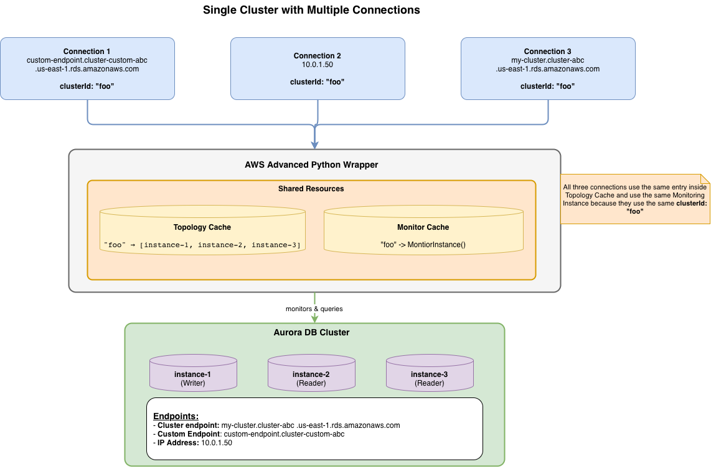
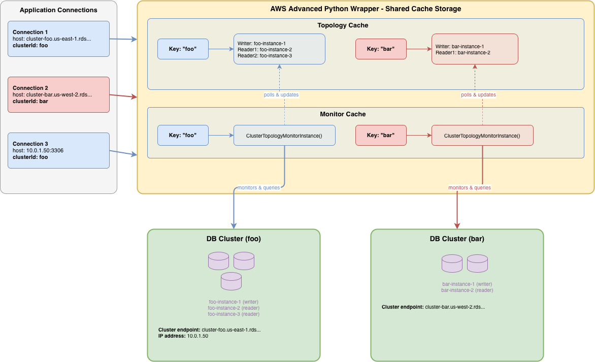

# Understanding the cluster_id Parameter

## Overview

The `cluster_id` parameter is a critical configuration setting when using the AWS Advanced Python Wrapper to **connect to multiple database clusters within a single application**. This parameter serves as a unique identifier that enables the wrapper to maintain separate caches and state for each distinct database cluster your application connects to.

## What is a Cluster?

Understanding what constitutes a cluster is crucial for correctly setting the `cluster_id` parameter. In the context of the AWS Advanced Python Wrapper, a **cluster** is a logical grouping of database instances that should share the same topology cache and monitoring services.

A cluster represents one writer instance (primary) and zero or more reader instances (replicas). These make up shared topology that the wrapper needs to track, and are the group of instances the wrapper can reconnect to when a failover is detected.

### Examples of Clusters

- Aurora DB Cluster (one writer + multiple readers)
- RDS Multi-AZ DB Cluster (one writer + two readers)
- Aurora Global Database (when supplying a global db endpoint, the wrapper considers them as a single cluster)

> **Rule of thumb:** If the wrapper should track separate topology information and perform independent failover operations, use different `cluster_id` values. If instances share the same topology and failover domain, use the same `cluster_id`.

## Why cluster_id is Important

The AWS Advanced Python Wrapper uses the `cluster_id` as a **key for internal caching mechanisms** to optimize performance and maintain cluster-specific state. Without proper `cluster_id` configuration, your application may experience:

- Cache collisions between different clusters
- Incorrect topology information
- Degraded performance due to cache invalidation

## Why Not Use AWS DB Cluster Identifiers?

Host information can take many forms:

- **IP Address Connections:** `10.0.1.50` ← No cluster info!
- **Custom Domain Names:** `db.mycompany.com` ← Custom domain
- **Custom Endpoints:** `my-custom-endpoint.cluster-custom-abc.us-east-1.rds.amazonaws.com` ← Custom endpoint
- **Proxy Connections:** `my-proxy.proxy-abc.us-east-1.rds.amazonaws.com` ← Proxy, not actual cluster

In fact, all of these could reference the exact same cluster. Therefore, because the wrapper cannot reliably parse cluster information from all connection types, **it is up to the user to explicitly provide the `cluster_id`**.

## How cluster_id is Used Internally

The wrapper uses `cluster_id` as a cache key for topology information and monitoring services. This enables multiple connections to the same cluster to share cached data and avoid redundant db meta-data.

### Example: Single Cluster with Multiple Connections

The following diagram shows how connections with the same `cluster_id` share cached resources:



**Key Points:**
- Three connections use different connection strings (custom endpoint, IP address, cluster endpoint) but all specify **`cluster_id="foo"`**
- All three connections share the same Topology Cache and Monitor Threads in the wrapper
- The Topology Cache stores a key-value mapping where `"foo"` maps to `["instance-1", "instance-2", "instance-3"]`
- Despite different connection URLs, all connections monitor and query the same physical database cluster

**The Impact:**
Shared resources eliminate redundant topology queries and reduce monitoring overhead.

### Example: Multiple Clusters with Separate Cache Isolation

The following diagram shows how different `cluster_id` values maintain separate caches for different clusters.



**Key Points:**
- Connection 1 and 3 use **`cluster_id="foo"`** and share the same cache entries
- Connection 2 uses **`cluster_id="bar"`** and has completely separate cache entries
- Each `cluster_id` acts as a key in the cache dictionary
- Topology Cache maintains separate entries: `"foo"` → `[instance-1, instance-2, instance-3]` and `"bar"` → `[instance-4, instance-5]`
- Monitor Cache maintains separate monitor threads for each cluster
- Monitors poll their respective database clusters and update the corresponding topology cache entries

**The Impact:**
This isolation prevents cache collisions and ensures correct failover behavior for each cluster.

## When to Specify cluster_id

### Required: Multiple Clusters in One Application

You **must** specify a unique `cluster_id` for every DB cluster when your application connects to multiple database clusters:

```python
from aws_advanced_python_wrapper import AwsWrapperConnection
from psycopg import Connection

# Source cluster connection
with AwsWrapperConnection.connect(
        Connection.connect,
        "host=source-db.us-east-1.rds.amazonaws.com dbname=mydb user=admin password=pwd",
        cluster_id="source-cluster",
        autocommit=True
) as source_conn:
    source_cursor = source_conn.cursor()
    source_cursor.execute("SELECT * FROM users")
    rows = source_cursor.fetchall()

# Destination cluster connection - different cluster_id!
with AwsWrapperConnection.connect(
        Connection.connect,
        "host=dest-db.us-west-2.rds.amazonaws.com dbname=mydb user=admin password=pwd",
        cluster_id="destination-cluster",
        autocommit=True
) as dest_conn:
    dest_cursor = dest_conn.cursor()
    # ... migration logic

# Connecting to source-db via IP - same cluster_id as source_conn
with AwsWrapperConnection.connect(
        Connection.connect,
        "host=10.0.0.1 dbname=mydb user=admin password=pwd",
        cluster_id="source-cluster",
        autocommit=True
) as source_ip_conn:
    pass
```

### Optional: Single Cluster Applications

If your application only connects to one cluster, you can omit `cluster_id` (defaults to `"1"`):

```python
from aws_advanced_python_wrapper import AwsWrapperConnection
from psycopg import Connection

# Single cluster - cluster_id defaults to "1"
with AwsWrapperConnection.connect(
        Connection.connect,
        "host=my-cluster.us-east-1.rds.amazonaws.com dbname=mydb user=admin password=pwd",
        autocommit=True
) as conn:
    cursor = conn.cursor()
    cursor.execute("SELECT 1")
```

This also includes if you have multiple connections using different host information:

```python
# cluster_id defaults to "1"
with AwsWrapperConnection.connect(
        Connection.connect,
        "host=my-cluster.us-east-1.rds.amazonaws.com dbname=mydb user=admin password=pwd",
        autocommit=True
) as url_conn:
    pass

# "10.0.0.1" -> IP address of my-cluster. Same cluster, so default cluster_id "1" is fine.
with AwsWrapperConnection.connect(
        Connection.connect,
        "host=10.0.0.1 dbname=mydb user=admin password=pwd",
        autocommit=True
) as ip_conn:
    pass
```

## Critical Warnings

### NEVER Share cluster_id Between Different Clusters

Using the same `cluster_id` for different database clusters will cause serious issues:

```python
# ❌ WRONG - Same cluster_id for different clusters
source_conn = AwsWrapperConnection.connect(
    Connection.connect,
    "host=source-db.us-east-1.rds.amazonaws.com dbname=db user=admin password=pwd",
    cluster_id="shared-id"  # ← BAD!
)

dest_conn = AwsWrapperConnection.connect(
    Connection.connect,
    "host=dest-db.us-west-2.rds.amazonaws.com dbname=db user=admin password=pwd",
    cluster_id="shared-id"  # ← BAD! Same ID for different cluster
)
```

**Problems this causes:**
- Topology cache collision (dest-db's topology could overwrite source-db's)
- Incorrect failover behavior (wrapper may try to failover to wrong cluster)
- Monitor conflicts (Only one monitor instance for both clusters will lead to undefined results)

**Correct approach:**
```python
# ✅ CORRECT - Unique cluster_id for each cluster
source_conn = AwsWrapperConnection.connect(
    Connection.connect,
    "host=source-db.us-east-1.rds.amazonaws.com dbname=db user=admin password=pwd",
    cluster_id="source-cluster"
)

dest_conn = AwsWrapperConnection.connect(
    Connection.connect,
    "host=dest-db.us-west-2.rds.amazonaws.com dbname=db user=admin password=pwd",
    cluster_id="destination-cluster"
)
```

### Always Use Same cluster_id for Same Cluster

Using different `cluster_id` values for the same cluster reduces efficiency:

```python
# ⚠️ SUBOPTIMAL - Different cluster_ids for same cluster
conn1 = AwsWrapperConnection.connect(
    Connection.connect,
    "host=my-cluster.us-east-1.rds.amazonaws.com dbname=db user=admin password=pwd",
    cluster_id="my-cluster-1"
)

conn2 = AwsWrapperConnection.connect(
    Connection.connect,
    "host=my-cluster.us-east-1.rds.amazonaws.com dbname=db user=admin password=pwd",
    cluster_id="my-cluster-2"  # Different ID for same cluster
)
```

**Problems this causes:**
- Duplication of caches
- Multiple monitoring threads for the same cluster

**Best practice:**
```python
# ✅ BEST - Same cluster_id for same cluster
CLUSTER_ID = "my-cluster"

conn1 = AwsWrapperConnection.connect(
    Connection.connect,
    "host=my-cluster.us-east-1.rds.amazonaws.com dbname=db user=admin password=pwd",
    cluster_id=CLUSTER_ID
)

conn2 = AwsWrapperConnection.connect(
    Connection.connect,
    "host=my-cluster.us-east-1.rds.amazonaws.com dbname=db user=admin password=pwd",
    cluster_id=CLUSTER_ID  # Shared cache and resources
)
```

## Summary

The `cluster_id` parameter is essential for applications connecting to multiple database clusters. It serves as a cache key for topology information and monitoring services. Always use unique `cluster_id` values for different clusters, and consistent values for the same cluster to maximize performance and avoid conflicts.
