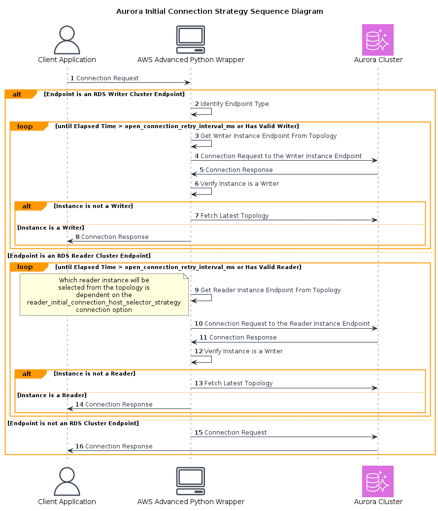

# Aurora Initial Connection Strategy Plugin
The Aurora Initial Connection Strategy Plugin allows users to configure their initial connection strategy, and it can also be used to obtain a connection more reliably if DNS is updating by replacing an out-of-date endpoint. 

The following sequence diagram describes the default plugin behaviour if no custom initial connection strategy is provided:

The AWS Advanced Python Wrapper may retry the connection attempts multiple times until it is able to connect to a valid reader instance or a valid writer instance.
You can configure how often to retry a connection and the maximum allowed time to obtain a connection using the `open_connection_retry_interval_ms` and the `open_connection_retry_timeout_ms` parameters respectively.

When this plugin is enabled, if the initial connection is to a reader cluster endpoint, the connected reader host will be chosen based on selection strategy specified using the `reader_initial_connection_host_selector_strategy` parameter.
See [initial connection strategy](../ReaderSelectionStrategies.md) for all possible strategies.

This plugin also helps retrieve connections more reliably. When a user connects to a cluster endpoint, the actual instance for a new connection is resolved by DNS.
During failover, the cluster elects another instance to be the writer. While DNS is updating, which can take up to 40-60 seconds, if a user tries to connect to the cluster endpoint, they may be connecting to an old host.
This plugin helps by replacing the out of date endpoint if DNS is updating.

## Enabling the Aurora Initial Connection Strategy Plugin

To enable the Aurora Initial Connection Strategy Plugin, add `initial_connection` to the [`plugins`](../UsingThePythonWrapper.md#connection-plugin-manager-parameters) value.

## Aurora Initial Connection Strategy Connection Parameters

The following properties can be used to configure the Aurora Initial Connection Strategy Plugin.

| Parameter                                          |  Value  | Required | Description                                                                                                                                                                                                              | Example            | Default Value |
|----------------------------------------------------|:-------:|:--------:|--------------------------------------------------------------------------------------------------------------------------------------------------------------------------------------------------------------------------|--------------------|---------------|
| `reader_initial_connection_host_selector_strategy` | String  |    No    | The strategy that will be used to select a new reader host when opening a new connection.    For more information on the available reader selection strategies, see this [table](../ReaderSelectionStrategies.md). | `leastConnections` | `random`      |
| `open_connection_retry_timeout_ms`                 | Integer |    No    | The maximum allowed time for retries when opening a connection in milliseconds.                                                                                                                                          | `40000`            | `30000`       |
| `open_connection_retry_interval_ms`                | Integer |    No    | The time between retries when opening a connection in milliseconds.                                                                                                                                                      | `2000`             | `1000`        |
