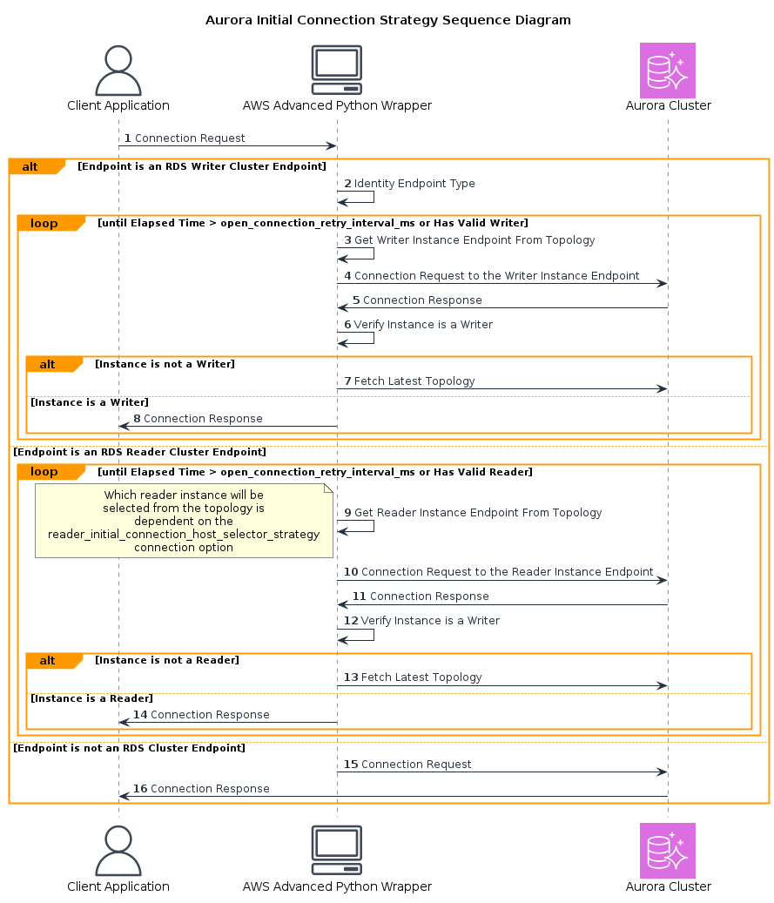

# Aurora Initial Connection Strategy Plugin
The Aurora Initial Connection Strategy Plugin allows users to configure their initial connection strategy, and it can also be used to obtain a connection more reliably if DNS is updating by replacing an out-of-date endpoint. 

The following sequence diagram describes the default plugin behaviour if no custom initial connection strategy is provided:
<div style="text-align:center"></div>
The AWS Advanced Python Wrapper may retry the connection attempts multiple times until it is able to connect to a valid reader instance or a valid writer instance.
You can configure how often to retry a connection and the maximum allowed time to obtain a connection using the `open_connection_retry_interval_ms` and the `open_connection_retry_timeout_ms` parameters respectively.

When this plugin is enabled, if the initial connection is to a reader cluster or custom cluster endpoint, the connected host will be chosen based on the configured selection strategy specified using the `initial_connection_host_selector_strategy` parameter.
See [initial connection strategy](../ReaderSelectionStrategies.md) for all possible strategies.

This plugin also helps retrieve connections more reliably. When a user connects to a cluster endpoint, the actual instance for a new connection is resolved by DNS.
During failover, the cluster elects another instance to be the writer. While DNS is updating, which can take up to 40-60 seconds, if a user tries to connect to the cluster endpoint, they may be connecting to an old host.
This plugin helps by replacing the out of date endpoint if DNS is updating.

When using Aurora Global Database, the user has an option to use an [Aurora Global Writer Endpoint](https://docs.aws.amazon.com/AmazonRDS/latest/AuroraUserGuide/aurora-global-database-connecting.html).
The Global Writer Endpoint makes application configuration easier, but like the cluster writer endpoint it can be affected by DNS updates. The plugin recognizes an Aurora Global Writer Endpoint and substitutes it with the current writer endpoint.

## Enabling the Aurora Initial Connection Strategy Plugin

To enable the Aurora Initial Connection Strategy Plugin, add `initial_connection` to the [`plugins`](../UsingThePythonWrapper.md#connection-plugin-manager-parameters) value.

## Aurora Initial Connection Strategy Connection Parameters

The following properties can be used to configure the Aurora Initial Connection Strategy Plugin.

| Parameter                                                 |  Value  | Required | Description                                                                                                                                                                                                                                                                                                                                                                                                                                                                                                                                                                                                                            | Example            | Default Value                                                                                                                                                             |
|-----------------------------------------------------------|:-------:|:--------:|----------------------------------------------------------------------------------------------------------------------------------------------------------------------------------------------------------------------------------------------------------------------------------------------------------------------------------------------------------------------------------------------------------------------------------------------------------------------------------------------------------------------------------------------------------------------------------------------------------------------------------------|--------------------|---------------------------------------------------------------------------------------------------------------------------------------------------------------------------|
| `initial_connection_host_selector_strategy`               | String  |    No    | The strategy that will be used to select a host when opening a new connection. A host will be selected according to the host role implied by `endpoint_substitution_role`. <br><br> For more information on the available selection strategies, see this [table](../ReaderSelectionStrategies.md).                                                                                                                                                                                                                                                                                                                                        | `least_connections`| `random`                                                                                                                                                                  |
| ~~`reader_initial_connection_host_selector_strategy`~~    | String  |    No    | **Deprecated. Use `initial_connection_host_selector_strategy` instead.** During the migration period, the value of `reader_initial_connection_host_selector_strategy` is used only when `initial_connection_host_selector_strategy` is omitted.                                                                                                                                                                                                                                                                                                                                                                                          | `least_connections`| `random`                                                                                                                                                                  |
| `endpoint_substitution_role`                              | String  |    No    | Defines whether the initial connection URL should be replaced with an instance URL from the topology when available, and if so, the role of the instance URL to select. Set this only when using a URL that resolves to a cluster endpoint (global writer, writer, reader, or custom). <br><br> For writer cluster or global writer endpoints, valid values are `writer` and `none`. For reader endpoints, valid values are `reader` and `none`. For custom cluster endpoints, valid values are `reader` and `none`. If set to `none`, the initial URL is not replaced. | `reader`           | `writer` for writer/global writer cluster endpoints.<br><br>`reader` for reader cluster endpoints.<br><br>Otherwise: `none` (no substitution).                            |
| `verify_opened_connection_type`                           | String  |    No    | Defines whether an opened connection should be verified to be a writer or reader after connecting, or if no role verification should be performed. <br><br> For writer or global writer endpoints, valid values are `writer` and `none`. For reader and custom endpoints, valid values are `reader` and `none`. The value `none` performs no role verification.                                                                                                                                                                                                                                                                          | `reader`           | `writer` for writer/global writer cluster endpoints.<br><br>`reader` for reader cluster endpoints.<br><br>Otherwise: `none`.                                              |
| `inactive_cluster_writer_endpoint_substitution_role`      | String  |    No    | Applicable to Aurora Global Databases. Defines whether the inactive cluster writer endpoint in the initial connection URL should be replaced with a writer instance URL from the topology when available. Region-bound cluster writer endpoints may be inactive depending on the Global Database primary region; this parameter configures the desired behavior for them. Valid values are `writer` and `none`.                                                                                                                                                                                                                          | `none`             | `writer`                                                                                                                                                                  |
| `verify_inactive_cluster_writer_endpoint_connection_type` | String  |    No    | Applicable to Aurora Global Databases. Defines whether a connection opened via an inactive cluster writer endpoint should be verified to be a writer, or if no role verification should be performed. Valid values are `writer` and `none`.                                                                                                                                                                                                                                                                                                                                                                                             | `none`             | `writer`                                                                                                                                                                  |
| `wait_for_initial_topology_ms`                            | Integer |    No    | Maximum time, in milliseconds, to wait for the cluster topology to be fetched before opening a new connection. When set greater than `0` and the topology is not yet available, the plugin blocks until the topology is discovered (or this timeout is reached) instead of falling back to connecting via the initial endpoint. This lets host selection strategies such as `round_robin` distribute concurrent and connection-pool prefill connections across instances rather than routing them all to a single DNS-resolved instance. The wait is scoped to the cluster. When set to `0` (the default) the previous behavior is preserved. | `30000`            | `0`                                                                                                                                                                       |
| `open_connection_retry_timeout_ms`                        | Integer |    No    | The maximum allowed time for retries when opening a connection in milliseconds.                                                                                                                                                                                                                                                                                                                                                                                                                                                                                                                                                        | `40000`            | `30000`                                                                                                                                                                   |
| `open_connection_retry_interval_ms`                       | Integer |    No    | The time between retries when opening a connection in milliseconds.                                                                                                                                                                                                                                                                                                                                                                                                                                                                                                                                                                    | `2000`             | `1000`                                                                                                                                                                    |

### Valid setting/endpoint combinations

`endpoint_substitution_role` and `verify_opened_connection_type` accept different values depending on the endpoint the connection URL resolves to:

| Endpoint type                    | `endpoint_substitution_role` | `verify_opened_connection_type` |
|----------------------------------|------------------------------|---------------------------------|
| Writer cluster / global writer   | `writer`, `none`             | `writer`, `none`                |
| Reader cluster                   | `reader`, `none`             | `reader`, `none`                |
| Custom cluster                   | `reader`, `none`             | `reader`, `none`                |
| Instance                         | `none` only                  | `none` only                     |

Setting a value outside the valid set for the given endpoint raises an error.

> **Note:** `endpoint_substitution_role=any` is accepted only for a custom cluster endpoint, but host selection for the `any` role is not currently supported — it raises an unsupported-strategy error at connect time. Use `reader` or `none` for custom cluster endpoints.

## Examples

Disable endpoint URL substitution. By default the plugin substitutes reader cluster URLs with a reader instance URL; setting the role to `none` removes this behavior:

```python
params = {
    "plugins": "initial_connection",
    "host": "mydb.cluster-ro-XYZ.us-east-1.rds.amazonaws.com",
    "endpoint_substitution_role": "none",
}
conn = AwsWrapperConnection.connect(psycopg.Connection.connect, **params)
```

Disable reader host verification when using a reader cluster URL. By default the plugin verifies that the opened connection landed on a reader:

```python
params = {
    "plugins": "initial_connection",
    "host": "mydb.cluster-ro-XYZ.us-east-1.rds.amazonaws.com",
    "verify_opened_connection_type": "none",
}
conn = AwsWrapperConnection.connect(psycopg.Connection.connect, **params)
```

Distribute concurrent and connection-pool prefill connections across readers. `wait_for_initial_topology_ms` blocks the first connections until the cluster topology is available, so `round_robin` can spread them across instances instead of all falling back to the single DNS-resolved reader cluster endpoint:

```python
params = {
    "plugins": "initial_connection",
    "host": "mydb.cluster-ro-XYZ.us-east-1.rds.amazonaws.com",
    "initial_connection_host_selector_strategy": "round_robin",
    "wait_for_initial_topology_ms": "30000",
}
conn = AwsWrapperConnection.connect(psycopg.Connection.connect, **params)
```
